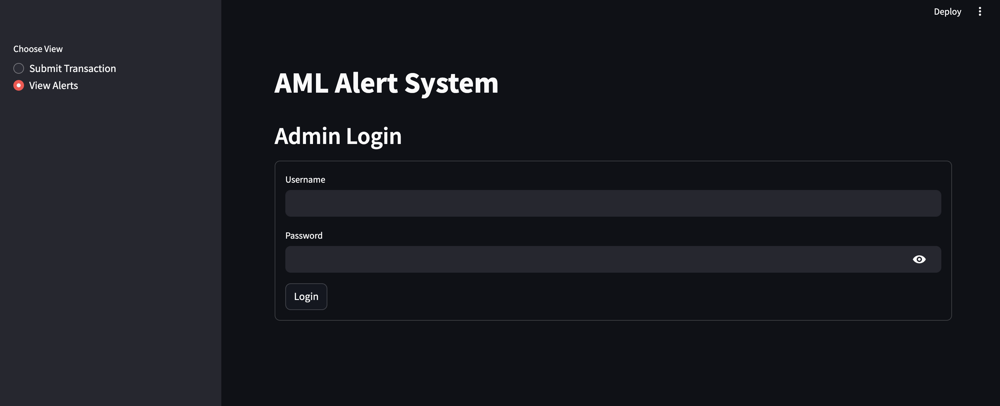
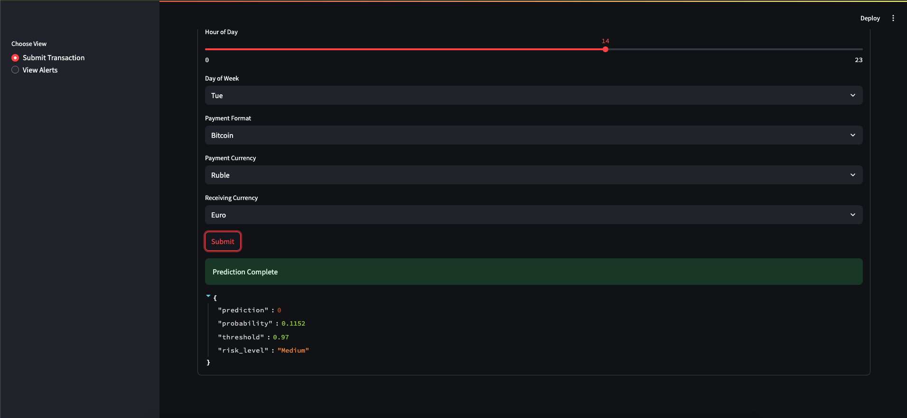

# AML Alert System

The **AML Alert System** detects potential money laundering in financial transactions using a machine learning model, a FastAPI backend, and a Streamlit frontend. It’s perfect for financial institutions, developers, and data scientists to monitor and flag suspicious activity.


*Figure 1: AML Alert System architecture, from transaction input to alert generation.*

## Features
- **Transaction Submission**: Input details via Streamlit.
- **Risk Prediction**: XGBoost model flags risks (High, Medium, Low, Very Low).
- **Alert Logging**: Logs high/medium-risk transactions to SQLite.
- **Admin Dashboard**: View alerts with admin login.
- **Feature Engineering**: Uses derived features like amount differences.

## Tech Stack
- **ML**: XGBoost, Pandas, Scikit-learn, Imblearn (SMOTE)
- **Backend**: FastAPI, SQLAlchemy (SQLite)
- **Frontend**: Streamlit
- **Other**: Joblib, NumPy, Requests
- **Language**: Python 3.8+

## Getting Started

### Prerequisites
- Python 3.8+
- pip
- Git (optional)

### Installation
1. **Clone Repository**:
   ```bash
   git clone https://github.com/saugatkarki17/aml-detection-pipeline.git
   cd aml-detection-pipeline
   ```
2. **Install Dependencies**:
   ```bash
   python -m venv venv
   source venv/bin/activate  # Windows: venv\Scripts\activate
   pip install -r requirements.txt
   ```
3. **Train Model**:
   - Place `processed_transactions.csv` in `data/`.
   - Run:
     ```bash
     python model.py
     ```
   - Saves `xgb_AML_model_advanced.joblib` in `src/`.
4. **Run Backend**:
   ```bash
   uvicorn amlApi.py:app --host 0.0.0.0 --port 8000
   ```
   API at `http://localhost:8000`.
5. **Run Frontend**:
   ```bash
   streamlit run frontend.py
   ```
   Open `http://localhost:8501`.

### Configuration
- **Database**: Uses SQLite (`alerts.db`). Update `DATABASE_URL` in `amlApi.py` for PostgreSQL.
- **Model Path**: Ensure `MODEL_PATH` in `amlApi.py` points to `src/xgb_AML_model_advanced.joblib`.
- **Admin Login**: Default `username: admin`, `password: secure123` (update in `frontend.py`).

## How It Works
1. Submit transactions via Streamlit.
2. `amlApi.py` predicts risk using XGBoost and logs alerts via `amlApi_alert.py`.
3. High/medium-risk transactions are stored in `alerts.db`.
4. Admins view alerts in the Streamlit dashboard.

## Model Details
- **Data**: Uses `processed_transactions.csv` with features like `amount_paid`, `txn_count`, and derived features.
- **Training**: 5-fold cross-validation, SMOTE, XGBoost (300 estimators, max depth 9, threshold 0.97).
- **Output**: Saves model, threshold, and features as `xgb_AML_model_advanced.joblib`.
- **Metrics**: Evaluated with ROC AUC.
- See `model.py` for details.

## Screenshots

*Figure 2: Streamlit interface for submission and alerts.*

## Contributing
Questions? Open an issue or contact maintainers.